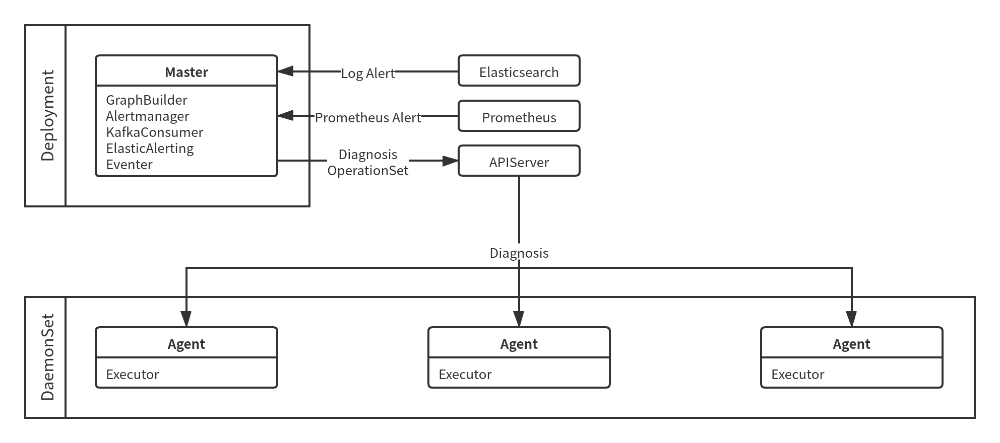

# KubeDiag 设计与架构

Kubernetes 是一个生产级的容器编排引擎，但是 Kubernetes 仍然存在系统复杂、故障诊断成本高等问题。KubeDiag 是基于 Kubernetes 云原生基础设施能力打造的框架，旨在解决云原生体系中故障诊断、运维恢复的自动化问题。主要包括以下几个维度：

* 由 Kubernetes 以及 Docker 的 Bug 引起的故障。
* 内核 Bug 导致的故障。
* 基础设施抖动产生的问题。
* 用户在容器化以及使用 Kubernetes 过程中遇到的问题。
* 用户在容器化后遇到的业务相关问题。

## 目标

KubeDiag 的设计目标包括：

* 可移植性：可以在部署 Kubernetes 的 Linux 标准环境下运行。
* 可扩展性：用户可以集成自定义的诊断功能。模块之间通过松耦合接口交互并且各功能模块均是可插拔式的。
* 自动化：极大降低问题诊断的人力成本。用户可以通过声明式 API 定义诊断工作流并且在问题发生时自动运行。
* 易用性：内置常见问题诊断逻辑以提供开箱即用的体验。

## 架构

KubeDiag 由管控面（Master）和代理（Agent）组成，并且从 APIServer 以及 Prometheus 等组件获取数据。

### 管控面

KubeDiag Master 负责管理 [Operation](./graph-based-pipeline.md#operation)、[OperationSet](./graph-based-pipeline.md#operationset)、[Trigger](./graph-based-pipeline.md#trigger) 和 [Diagnosis](./diagnosis.md) 对象。当 OperationSet 创建后，KubeDiag Master 会进行合法性检查并基于用户定义生成有向无环图，所有的诊断路径被更新至 OperationSet 的元数据中。如果 OperationSet 中某个 Operation 的前置依赖诊断操作不存在，则该 OperationSet 会被标记为异常。

KubeDiag Master 会校验 Diagnosis 的 PodReference 或 NodeName 是否存在，如果 Diagnosis 中只定义了 PodReference，则根据 PodReference 计算并更新 NodeName。KubeDiag Master 会查询被 Diagnosis 引用的 OperationSet 状态，如果被引用的 OperationSet 异常，则标记 Diagnosis 失败。Diagnosis 可以由用户直接手动创建，也可以通过配置 Prometheus 报警模板或 Event 模板自动创建。

KubeDiag Master 由下列部分组成：

* 图构建器（GraphBuilder）
* Prometheus 报警管理器（Alertmanager）
* Kafka 消息管理器（KafkaConsumer）
* 事件管理器（Eventer）

#### 图构建器

图构建器基于 OperationSet 对象生成诊断运行流程图。图构建器根据 OperationSet 中包含的边生成有向无环图并计算出所有的诊断路径。

#### Prometheus 报警管理器

Prometheus 报警管理器接收 Prometheus 报警并创建 Diagnosis 对象。Prometheus 报警管理器可以接收 Prometheus 报警并与 Trigger 中定义的模板进行匹配，如果匹配成功则根据 Trigger 的元数据创建 Diagnosis 对象。

#### Kafka 消息管理器

Kafka 消息管理器接收 Kafka 消息并创建 Diagnosis 对象。Kafka 消息的值必须是一个 JSON 对象并且包含创建 Diagnosis 所需的元信息。

#### 事件管理器

事件管理器接收 Kubernetes Event 并创建 Diagnosis 对象。事件管理器可以接收 Kubernetes Event 并与 Trigger 中定义的模板进行匹配，如果匹配成功则根据 Trigger 的元数据创建 Diagnosis 对象。

### 代理

KubeDiag Agent 负责实际诊断工作的执行并内置多个常用诊断操作。当 Diagnosis 创建后，KubeDiag Agent 会根据 Diagnosis 引用的 OperationSet 执行诊断工作流，诊断工作流是包括多个诊断操作的集合。

KubeDiag Agent 组件由下列部分组成：

* 执行器（Executor）

#### 执行器

执行器负责执行诊断工作流。Diagnosis 引用的 OperationSet 元数据中包含表示诊断工作流的有向无环图和所有的诊断路径。诊断路径表示诊断过程中的排查路径，通过执行某个诊断路径中每个顶点的诊断操作可以对问题进行排查。如果某个诊断路径的所有诊断操作均执行成功，则该次诊断被标记为成功。如果所有诊断路径均执行失败，则该次诊断被标记为失败。
