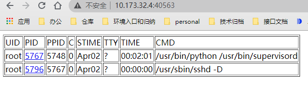
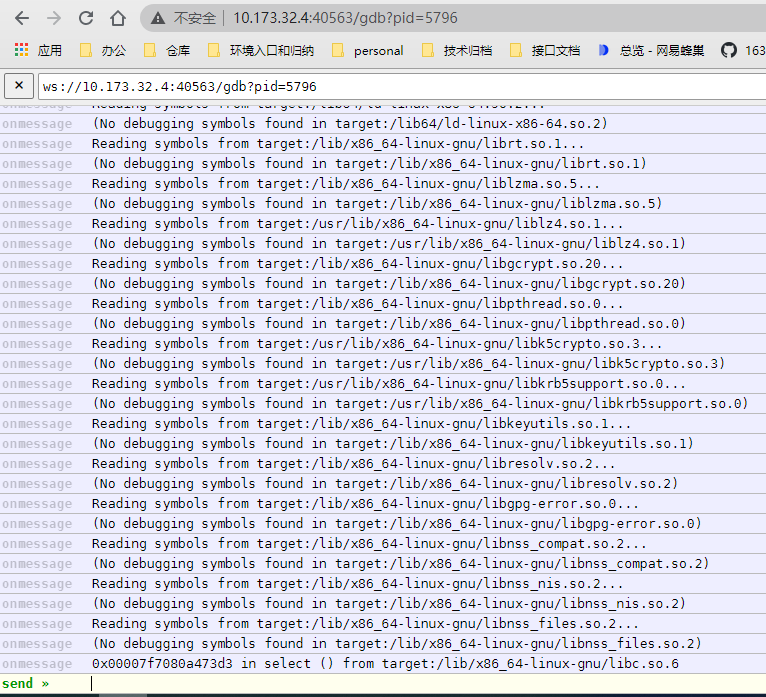
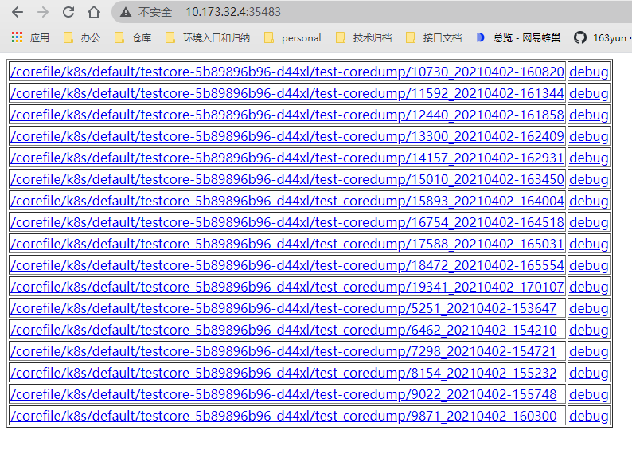
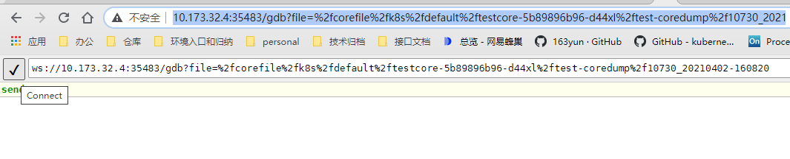
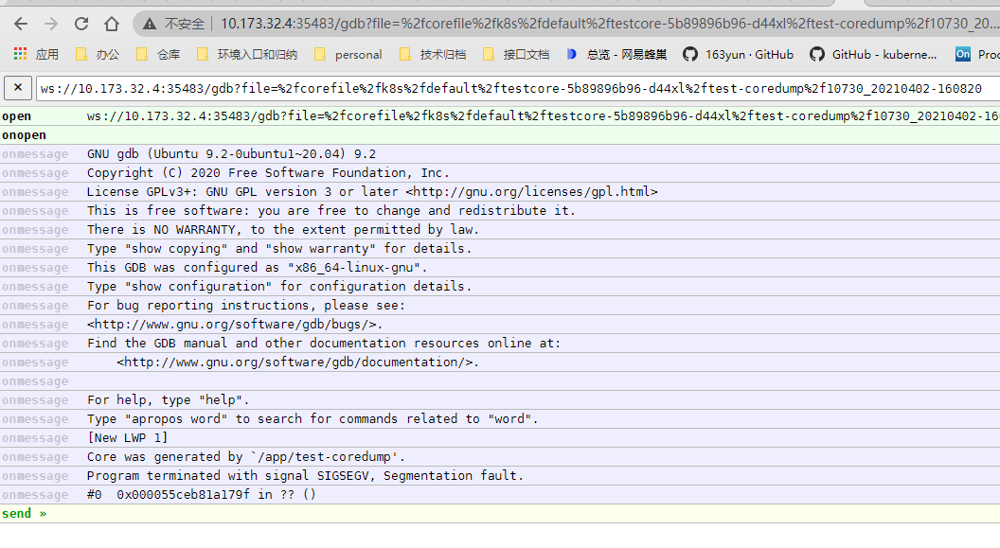

# Core File Profiler

Core File Profiler 是一个 [Processor](../design/processor.md)，用户可以通过 Core File Profiler 采集节点上容器的 coredump 信息或直接进行 gdb 调试。

## 背景

用户容器中的业务进程在发成异常退出时，通常可以通过触发 [coredump](https://wiki.archlinux.org/index.php/Core_dump) 保留进程地址空间，事后可以通过 coredump 文件，以及进程本身，进行详细的调试工作。

## 实现

Core File Profiler 按照 [Processor](../design/processor.md) 规范实现。通过 Operation 可以在 KubeDiag 中注册 Core File Profiler，该 Operation 在 KubeDiag Agent 部署时默认注册，但整体功能是关闭的，可以在部署 KubeDiag Agent 时在启动参数中配置：`--feature-gates=CorefileProfiler=true` 打开该功能，执行下列命令可以查看已注册的 Core File Profiler：

```bash
$ kubectl get operation core-file-profiler -o yaml
apiVersion: diagnosis.kubediag.org/v1
kind: Operation
metadata:
  name: core-file-profiler
  resourceVersion: "57862"
  selfLink: /apis/diagnosis.kubediag.org/v1/operations/core-file-profiler
  uid: 1feb15cc-4000-4934-a2dc-9433bbf6e9da
spec:
  processor:
    path: /processor/coreFileProfiler
    scheme: http
    timeoutSeconds: 60
```

### HTTP 请求格式

Core File Profiler 处理的请求必须为 POST 类型，处理的 HTTP 请求中包含请求体。

#### HTTP 请求

POST /processor/coreFileProfiler

#### HTTP 请求体

```json
{
  "param.diagnoser.runtime.core_file_profiler.expiration_seconds": "200",
  "param.diagnoser.runtime.core_file_profiler.type": "coredump",
  "param.diagnoser.runtime.core_file_profiler.filepath": "/data/coredump/core", // 指定 coredump 文件路径。 可选，默认为空
  "param.diagnoser.runtime.core_file_profiler.pid": "0" // 指定 gcore 进程号。 可选，默认为0
}
```

请求体中 parameter 结构里包含四个参数，为了方便阅读，此处做了简写：

- expiration_seconds 表示 Core File Profiler 启动的 HTTP 服务的运行时间（单位为秒）。一定时间内，用户可以访问该 HTTP 服务
- type 表示 Core File Profiler 提供的服务类型。 可选值有二：
  - coredump 将启动一个 HTTP 服务，提供 coredump 文件的下载或在线调试
  - gcore 将直接启动一个 websocket 服务，提供指定进程的在线调试
- filePath 当 type 为 coredump 时，通过此字段，用户可以显式指定 coredump 文件路径或目录，需要注意，该路径或其父目录必须挂载到 KubeDiag Agent 中，否则无法提供访问; 当该字段为空时，Corefile Profiler 会基于相关 pod 的 Namespace 、 Name 、 ContainerName 信息，找到特定的存放 coredump 文件的目录，其中的原理可以参考[下文](#coredump转储原理说明)
- pid 当 type 为 gcore 时，通过此字段，用户可以直接在线调试一个运行中进程。需要注意，此处的 pid 的值必须是宿主机侧的进程号。

#### 状态码

| Code | Description |
|-|-|
| 200 | OK |
| 405 | Method Not Allowed |
| 500 | Internal Server Error |

#### 返回体

HTTP 请求返回体格式为 String ，值为 Corefile Profiler 提供的 HTTP 服务的地址：

```
http://my-node:46765
```

并且最终，这部分信息将会记录在 Diagnosis 对象的 status 中， 如下：

```yaml
apiVersion: diagnosis.kubediag.org/v1
kind: Diagnosis
metadata:
  name: diagnosis-coreprofiler-example
spec:
  ...
status:
  phase: Succeeded
  ...
  operationResults:
    diagnoser.runtime.core_file_profiler.result.endpoint: http://my-node:46765
    ...
```

### 举例说明

阅读本例前，请确保节点上已经按照[转储配置](# 本文配置使用的存储方式)中的说明进行配置。确保容器的 coredump 文件均会被转储到与所属 pod 信息对应的路径下。

#### 准备工作

1. 创建 Operation 和 OperationSet：

   ```yaml
   apiVersion: diagnosis.kubediag.org/v1
   kind: Operation
   metadata:
     name: core-file-profiler
   spec:
     processor:
       path: /processor/coreFileProfiler
       scheme: http
       timeoutSeconds: 60
   ---
   apiVersion: diagnosis.kubediag.org/v1
   kind: OperationSet
   metadata:
     name: core-profiler-operationset
   spec:
     adjacencyList:
     - id: 0
       to:
       - 1
       - 2
     - id: 1
       operation: pod-list-collector
     - id: 2
       operation: core-file-profiler
   ```

2. 创建一个测试用的 pod ，该 pod 会在 sleep 3分钟后异常退出 ：

   ```bash
   $ kubectl create deploy testcore --image hub.c.163.com/kubediag/test-coredump:latest
   $ kubectl get pod -o wide
   NAME                        READY   STATUS    RESTARTS   AGE  IP            NODE      NOMINATED NODE   READINESS GATES
   testcore-5b89896b96-d44xl   1/1     Running   1          2m   10.244.0.31   my-node   <none>           <none>
   ```

#### Gcore 分析

1. 创建一个 Diagnosis 对象， 对这个 pod 进行 coredump 分析:

   ```yaml
   apiVersion: diagnosis.kubediag.org/v1
   kind: Diagnosis
   metadata:
     name: diagnosis-coreprofiler-example
   spec:
     parameters:
       "param.diagnoser.runtime.core_file_profiler.expiration_seconds": "2000"
       "param.diagnoser.runtime.core_file_profiler.type": "gcore"
     operationSet: core-profiler-operationset
     nodeName: my-node
     podReference:
       namespace: default
       name: testcore-5b89896b96-d44xl
       container: test-coredump
   ```

   创建后，该 Diagnosis 将会在指定节点上由 KubeDiag Agent 组件接管执行。KubeDiag Agent 向 Corefile Profiler 发送 HTTP 请求，请求类型为 POST，请求中包含请求体，请求体将包括 `spec.parameters` 中的所有信息，和 `spec.podReference` 中的 Pod 相关信息：

   ```json
   {
     "param.diagnoser.runtime.core_file_profiler.expiration_seconds": "2000",
     "param.diagnoser.runtime.core_file_profiler.type": "gcore",
     "pod.namespace": "default",
     "pod.name": "testcore-5b89896b96-d44xl",
     "container": "test-coredump"
   }
   ```

2. 等待 Corefile Profiler 处理完毕，在 HTTP response 中告知了自己新启动的 HTTP 服务地址，查看 Diagnosis 对象：

   ```yaml
   apiVersion: diagnosis.kubediag.org/v1
   kind: Diagnosis
   metadata:
     name: diagnosis-coreprofiler-example
   spec:
     parameters:
       "param.diagnoser.runtime.core_file_profiler.expiration_seconds": "2000"
       "param.diagnoser.runtime.core_file_profiler.type": "gcore"
     operationSet: core-profiler-operationset
     nodeName: my-node
     podReference:
       namespace: default
       name: testcore-5b89896b96-d44xl
       container: test-coredump
   status:
     phase: Succeeded
     checkpoint:
       nodeIndex: 1
       pathIndex: 1
     conditions:
       ...
     operationResults:
       diagnoser.runtime.core_file_profiler.result.endpoint: http://my-node:40563  
       pod.list: ...
   ```

   可以看到，在 ID 为 2 的 operation 中有了结果：`http://my-node:40563`, 说明这次 type 为 gcore 的 Core File Profiler 执行成功了 【注：这里 Core File Profiler 是通过 pod 信息在本地检索容器，找到了运行中的业务容器进程】

3. 我们在浏览器中访问 `http://my-node:40563`，将看到一个 web页面：

   

4. 点击 PID 列的任何一个进程， 会打开一个新页面，点击 √ ，我们直接进入了对该进程的 gdb 调试：

   

#### 指定 pid 进行 gcore

默认情况下我们不需要指定 pid ， Core File Profiler 将会基于 Diagnosis 对象中的 pod 信息， 在本地找到匹配的、运行中的容器，从而获取到容器进程号，并进行 gcore ; 如果找不到对应的容器，该次 operation 将以失败告终。

若我们需要指定 pid ， 可以在 Diagnosis 对象中，相应 operation 的 parameter 中追加该参数。如：

```yaml
apiVersion: diagnosis.kubediag.org/v1
kind: Diagnosis
metadata:
  name: diagnosis-coreprofiler-example
spec:
  parameters:
    "param.diagnoser.runtime.core_file_profiler.expiration_seconds": "2000"
    "param.diagnoser.runtime.core_file_profiler.type": "gcore"
    "param.diagnoser.runtime.core_file_profiler.pid": "5767"
    ...
```

若 Core File Profiler 找不到该进程， 该次 operation 将以 failed 告终。

#### Coredump 分析

1. 当上述的 pod 运行超过3分钟后， pod 进入了 CrashLoopBackOff 状态， 我们此时将之前的 Diagnosis 对象删除并重新创建一个心的 Diagnosis ：

   ```yaml
   apiVersion: diagnosis.kubediag.org/v1
   kind: Diagnosis
   metadata:
     name: diagnosis-coreprofiler-example
   spec:
     parameters:
       "param.diagnoser.runtime.core_file_profiler.expiration_seconds": "2000"
       "param.diagnoser.runtime.core_file_profiler.type": "coredump"
     operationSet: core-profiler-operationset
     nodeName: my-node
     podReference:
       namespace: default
       name: testcore-5b89896b96-d44xl
       container: test-coredump
   ```

   ```bash
   $ kubectl create deploy testcore --image hub.c.163.com/kubediag/test-coredump:latest
   $ kubectl get pod -o wide
   NAME                        READY   STATUS             RESTARTS   AGE     IP            NODE    NOMINATED NODE   READINESS GATES
   testcore-5b89896b96-d44xl   0/1     CrashLoopBackOff   1         5m   10.244.0.31   my-node   <none>           <none>
   $ kubectl delete diagnosis diagnosis-coreprofiler-example
   $ kubectl create -f diagnosis-coreprofiler-example.yaml
   ```

2. 接着我们查看 Diagnosis 对象的状态：

   ```bash
   $ kubectl get diagnosis diagnosis-coreprofiler-example -o yaml
   apiVersion: diagnosis.kubediag.org/v1
   kind: Diagnosis
   metadata:
     name: diagnosis-coreprofiler-example
     namespace: default
     resourceVersion: "1628675"
     selfLink: /apis/diagnosis.kubediag.org/v1/namespaces/default/diagnoses/diagnosis-coreprofiler-example
     uid: 2a13263e-c1cb-4087-9d1b-e918de2e8fe7
   spec:
     nodeName: my-node
     operationSet: core-profiler-operationset
     parameters:
       "param.diagnoser.runtime.core_file_profiler.expiration_seconds": "2000"
       "param.diagnoser.runtime.core_file_profiler.type": "coredump"
     podReference:
       container: test-coredump
       name: testcore-5b89896b96-d44xl
       namespace: default
   status:
     ...
     operationResults:
       diagnoser.runtime.core_file_profiler.result.endpoint": http://my-node:33907
     phase: Succeeded
     startTime: "2021-04-06T02:55:56Z"
     succeededPath:
     - id: 2
       operation: core-file-profiler
   ```

   可以看到 coredump 分析成功。

   在 coredump 分析中， KubeDiag Agent 向 Corefile Profiler 发起另一个 HTTP POST 请求，body 如下：

   ```json
   {
     "param.diagnoser.runtime.core_file_profiler.expiration_seconds": "2000",
     "param.diagnoser.runtime.core_file_profiler.type": "coredump",
     "pod.namespace": "default",
     "pod.name": "testcore-5b89896b96-d44xl",
     "container": "test-coredump"
   }
   ```

3. 通过访问 result 中记录的 url， 我们将看到一个文件管理页面：

   

4. 点击文件名可以下载对应的 coredump 文件。

5. 点击文件名后面的 debug 可以进入 webocket 页面，进行在线的 gdb 调试:

   

   

#### 指定 FilePath 进行 Coredump

默认情况下，Core File Profiler 在处理 coredump 类型的请求时， 会从 :

```
/var/lib/kubediag/corefile/kubernetes/
```

目录下开始查找 coredump 文件。查找的具体路径将会是：

```
/var/lib/kubediag/corefile/kubernetes/$POD_NAMESPACE/$POD_NAME/$CONTAINER_NAME/
```

在这个目录下， 将会记录某个容器的所有 coredump 文件 。

如果容器总是发生 coredump 并且总是会被重启，那么每次coredump的文件都会记录进去，但是文件名不同， 文件名会以：`$Pid_$Timestamp`的格式。 例如：

```bash
# ls -l /var/lib/kubediag/corefile/kubernetes/default/testcore-5b89896b96-d44xl/test-coredump
total 2688
-rw-rw-rw- 1 root root 393216 Apr  6 10:54 47305_20210406-105419
-rw-rw-rw- 1 root root 393216 Apr  6 10:59 55276_20210406-105931
-rw-rw-rw- 1 root root 393216 Apr  6 11:04 56216_20210406-110444
-rw-rw-rw- 1 root root 393216 Apr  6 11:10 57055_20210406-111001
-rw-rw-rw- 1 root root 393216 Apr  6 11:15 57903_20210406-111516
-rw-rw-rw- 1 root root 393216 Apr  6 11:20 58755_20210406-112031
-rw-rw-rw- 1 root root 393216 Apr  6 11:25 59564_20210406-112542
```

用户也可以自己指定 coredump 文件的存储目录或完整路径。在 Diagnosis 对象中，相应 operation 的 parameter 中追加该参数。如：

```yaml
apiVersion: diagnosis.kubediag.org/v1
kind: Diagnosis
metadata:
  name: diagnosis-coreprofiler-example
spec:
  parameters:
    "param.diagnoser.runtime.core_file_profiler.expiration_seconds": "2000"
    "param.diagnoser.runtime.core_file_profiler.type": "coredump"
    "param.diagnoser.runtime.core_file_profiler.filepath": "/core"
   ...
```

若 Core File Profiler 找不到该路径或文件， 则该次 operation 将以失败告终。 注意，Core File Profiler 无法识别某个文件是否是 coredump 文件， 只要路径存在， corefile profiler 就会建立起 HTTP Server。

#### 查找pod下所有容器的 coredump

1. 我们在创建 Diagnosis 对象时，写入不完整的 pod 信息， 比如缺少 container 的名字：

   ```yaml
   apiVersion: diagnosis.kubediag.org/v1
   kind: Diagnosis
   metadata:
     name: diagnosis-coreprofiler-example
   spec:
     nodeName: my-node
     operationSet: core-profiler-example
     parameters:
       "param.diagnoser.runtime.core_file_profiler.expiration_seconds": "2000"
       "param.diagnoser.runtime.core_file_profiler.type": "coredump"
     podReference:
       name: testcore-5b89896b96-d44xl
       namespace: default
   ```

   这种情况下，访问 Core File Profiler 时， body 中将会缺少 `container` 参数， Core File Profiler 将会把该 pod 的所有容器的 coredump 文件都列举出来。 也即：`/var/lib/kubediag/corefile/kubernetes/default/testcore-5b89896b96-d44xl/`下的所有子目录的所有文件。

2. 访问 operationResult 中记录的 url ：

   

## Coredump 转储原理说明

容器本身是与宿主机共享内核的一组进程，一旦容器内的进程发生崩溃，需要收集 coredump 文件的时候，这里对相关的实践做一些说明。

### Ulimit

默认情况下，我们**关闭**了 docker 的 ulimit 配置，避免写 core 文件时候的 io 过大，干扰同机器上的其他业务。

Kubernetes 目前不支持设置 pod 的 ulimit 值，社区也有关这方面的讨论，[issues-3595](https://github.com/kubernetes/kubernetes/issues/3595) ，如果需要 Kubernetes 支持，可以通过制作设置了 ulimit 的镜像来部署 pod ：

```bash
#!/bin/bash
# Set memlock limit
ulimit -l 33554432
# Call original entrypoint script
exec /docker-entrypoint.sh "${@}"
```

```Dockerfile
FROM strapdata/elassandra:5.5.0.20
COPY custom-entrypoint.sh /custom-entrypoint.sh
ENTRYPOINT ["/custom-entrypoint.sh"]
CMD ["bin/cassandra"]
```

对于一开始程序运行时，core file 大小的 ulimit 设置为 0 的情况，有较高权限(如 previliged )的用户，可以在运行时，通过`prlimit` 命令（实际是 setrlimit 系统调用）强制调大进程的 core file 大小限制。

非 previliged 的容器中的进程会默认 drop 掉所有的 capabilities ，因此如果使用这种方式，调小 ulimit 值不受影响，如果需要调大 ulimit 值，则需要增加相应的 capabilites 要求，需要配置 securityContext ，具体示例如下：

```yaml
securityContext:
  capabilities:
    add:
    - IPC_LOCK
    - SYS_RESOURCE # 这个是容器内想调大ulimit配置时必备的
```

### 存储方式

- `kernel.core_pattern`

   默认值是`core`, 也就是说，如果不做特殊配置，生成的 core 文件会在应用程序的同目录，文件名为 core .

   `core_pattern` 支持绝对路径、相对路径（相对于 crash 的进程的工作目录）以及可以通过管道传给一个用户态的可执行文件，由用户程序进行处理。

   针对容器场景下，如果配置的是绝对路径或者相对路径，那么这个路径的解析在容器本身的 mount namespace 中进行，也就是说具体的 coredump 文件的写入地方，会是容器中的某一个路径。当然如果不是容器中的进程，则会写入到系统的某一个配置的路径中。

   **这里需要注意的是**， 如果配置了通过管道交给一个用户态程序处理，这个用户应用程序的执行是的 namespace 上下文会是系统全局的上下文，也就是说这个用来采集 coredump 的用户态程序，是在宿主机的文件系统、网络等上下文执行的，而不管这个挂掉的进程是不是在容器中跑的。不过这个用户态程序，可以通过一定的手段进入到相关的容器上下文中，来记录要采集的 core 文件。linux 以后也不会实现 coredump 通过管道采集 core 文件的脚本放到容器上下文中，这个问题的讨论，可以参考 [https://www.spinics.net/lists/linux-containers/msg21522.html](https://www.spinics.net/lists/linux-containers/msg21522.html).

   如果配置的这个用户态可执行文件不存在或者存在但是不可执行，则 coredump 不会发生。这个用户态的程序可以是脚本，可以是二进制，只要是可执行即可。

   `core_pattern` 中还支持一些占位服，比如程序的名字，发生 coredump 的时间等，可以通过这些信息，来生成具体的 coredump 文件的路径，以备后续查看。

- `kernel.core_pipe_limit`

   当我们使用管道的形式进行 core 文件采集时，如果需要访问这个崩溃的进程一些信息，比如 namespace 信息等，则需要让这个崩溃的进程的一些元信息延迟回收。这个参数是用来控制延迟回收崩溃进程相关资源回收的，配置值为最大同时允许延迟回收的最大数。

   该值默认是 0 ，不进行延迟回收，如果我们有需求，可以调大。

- `kernel.core_uses_pid`, `fs.suid_dumpable`

   这些参数也是用来控制如何进行 coredump 行为的，包括兼容性、安全性等，不过绝大部分情况下，我们只需要保持默认配置即可。

- `/proc/<pid>/coredump_filter`

   这个配置是进程级的，每个进程可以通过这个文件来控制一旦发生 coredump 的时候，去 dump 哪些内容，默认是16进制的 0x33 ，会 dump ELF 头信息，私有大页，还有匿名内存（一般就是可执行代码的地址以及代码中申请的地址），如果要 dump 更多东西，可以参考相关的 linux 的文档进行配置。

- `/proc/sys/kernel/core_uses_pid`

   这个配置可以控制 core 文件的文件名中是否添加 pid 作为扩展。文件内容为 1 ，表示添加 pid 作为扩展名，生成的 core 文件格式为 core.xxxx ；为 0 则表示生成的 core 文件同一命名为 core 。

#### 本文配置使用的存储方式

在 KubeDiag 支持 corefile profiler 的实践中， 我们要求：

- 每个节点上设置：
  - /proc/sys/kernel/core_uses_pid = 1
  - /proc/sys/kernel/core_pattern = `| /usr/local/bin/core_file_naming.sh %P %t`
- 每个节点上放置脚本： /usr/local/bin/core_file_naming.sh 。内容如下：

```bash
#!/bin/bash
pid=$1
timestamp=$2

root='/var/lib/kubediag/corefile/'
ls ${root} || mkdir -p ${root}
docker_root=`docker info 2>&1|grep "Docker Root Dir" |awk '{print $NF}'`

if [ "$docker_root"x == ""x ] ; then
        realfile="/${root}/${pid}_$(date -d @${timestamp} "+%Y%m%d-%H%M%S")"
        cat /dev/stdin > $realfile
        exit
fi

containerinfo=`fgrep -h -r "\"Pid\":${pid}," ${docker_root}/containers/*/config.v2.json`
if [ "$containerinfo"x == ""x ] ; then
        realfile="${root}/${pid}_$(date -d @${timestamp} "+%Y%m%d-%H%M%S")"
else
        kube_info=`echo $containerinfo | python -c "import sys,json;data=json.loads(sys.stdin.read());kube_info=data['Config']['Labels']['io.kubernetes.pod.namespace'] + '/' + data['Config']['Labels']['io.kubernetes.pod.name'] + '/' + data['Config']['Labels']['io.kubernetes.container.name'] ; print kube_info"`
        realfile="${root}/kubernetes/${kube_info}/${pid}_$(date -d @${timestamp} "+%Y%m%d-%H%M%S")"
        mkdir -p ${root}/kubernetes/${kube_info}/
fi

cat /dev/stdin > $realfile
```

也就是说， 当发生 coredump 时， 将会根据 进程号， 在 docker 存储目录下找到对应的容器信息文件， 并基于对应的容器的 label 信息，确认是哪个 pod 的哪个 container 触发的 coredump 。基于 pod 的信息构建一个特定的存储路径， coredump 文件将以进程号和时间戳组织成文件名，存储于该路径下。
