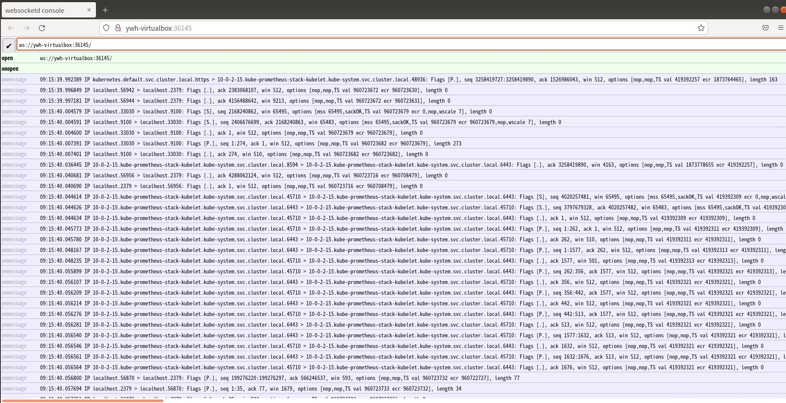

# Tcpdump Profiler

Tcpdump Profiler is a [Processor](../design/processor.md). Tcpdump Profiler utilize tcpdump to start a remote capture on any pod or host in your kubernetes cluster.

## Intro

When network debugging in kubernetes cluster, it can be helpful to capture network activities on specified pod or host.

Tcpdump Profiler use tcpdump to capture packets from a network interface and redirect it's output.

## Implementation

Tcpdump Profiler is implemented according to [Processor](../design/processor.md). Register Tcpdump Profiler via Operation in Kubediag. Get registed Tcpdump Profiler：

```bash
$ kubectl get operation net-info-operation -o yaml
apiVersion: diagnosis.kubediag.org/v1
kind: Operation
metadata:
  name: net-info-operation
  resourceVersion: "529760"
  selfLink: /apis/diagnosis.kubediag.org/v1/operations/net-info-operation
  uid: 29747bb4-9c12-4a68-9821-1e9fe896b3ce
spec:
  processor:
    httpServer:
      path: /processor/tcpdumpProfiler
      scheme: http
    timeoutSeconds: 30
```

### HTTP Request Format

Tcpdump Profiler handles http POST request with request body.

#### HTTP Request

POST /processor/tcpDumpProfiler

#### HTTP Request Body

```json
{
    "param.diagnoser.runtime.tcpdump_profiler.expiration_seconds": <EXPIRATION_SECONDS>,  // Optional. 
    "param.diagnoser.runtime.tcpdump_profiler.container": <CONTAINER_ID>, // Optional. 
    "param.diagnoser.runtime.tcpdump_profiler.interface": <INTERFACE>, // Optional. 
    "param.diagnoser.runtime.tcpdump_profiler.filter": <EXPRESSION>, // Optional.
}

 EXPIRATION_SECONDS: Expiration seconds of the server built in tcpdump profiler.
 CONTAINER_ID: If omitted, the first container in container list of the pod will be selected.
 INTERFACE: The network interfaces available on the system and on which tcpdump can capture packets (Print the list via `tcpdump -D`). If omitted, an interface argument of "any" will be used to capture packets from all interfaces.
 EXPRESSION: Selects which packets will be dumped. If no expression is given, all packets on the net will be dumped. Otherwise, only packets for which expression is 'true' will be dumped.
```

#### Status Code

| Code | Description |
|-|-|
| 200 | OK |
| 405 | Method Not Allowed |
| 500 | Internal Server Error |

#### Response Body

The response body contains endpoint supported by tcpdump profiler：

```bash
http://my-node:35699
```

Above information will be recorded in `status` of Diagnosis object:

```yaml
apiVersion: diagnosis.kubediag.org/v1
kind: Diagnosis
metadata:
  name: diagnosis-tcpdumpprofiler-example
spec:
  ...
status:
  phase: Succeeded
  ...
  operationResults:
    diagnoser.runtime.tcpdump_profiler.result.Endpoint: http://my-node:35699
    ...
```

### Examples

1. Create Operation and OperationSet：

```yaml
apiVersion: diagnosis.kubediag.org/v1
kind: Operation
metadata:
  name: tcpdump
spec:
  processor:
    httpServer:
    path: /processor/tcpdumpProfiler
    scheme: http
    timeoutSeconfs: 60
---
apiVersion: diagnosis.kubediag.org/v1
kind: OperationSet
metadata:
  name: tcpdump
spec:
  adjacencyList:
  - id: 0
    to:
    - 1
  - id: 1
    operation: tcpdump
```

2. Create a Diagnosis to capture packets on specified pod：

```yaml
apiVersion: diagnosis.kubediag.org/v1
kind: Diagnosis
metadata:
  name: pod-diagnosis
spec:
  operationSet: tcpdump
  nodeName: <my-node>
  podReference:
    namespace: <namespace>
    name: <pod-name>
  parameters:
    "param.diagnoser.runtime.tcpdump_profiler.expiration_seconds": "2000"
    "param.diagnoser.runtime.tcpdump_profiler.container": <container_name>
    "param.diagnoser.runtime.tcpdump_profiler.interface": <interface>
    "param.diagnoser.runtime.tcpdump_profiler.filter": <expression>
```

Or you can create a Diganosis to capture packets on specified node without `podReference`:

```yaml
apiVersion: diagnosis.kubediag.org/v1
kind: Diagnosis
metadata:
  name: pod-diagnosis
spec:
  operationSet: tcpdump
  nodeName: <my-node>
  parameters:
    "param.diagnoser.runtime.tcpdump_profiler.expiration_seconds": "2000"
    "param.diagnoser.runtime.tcpdump_profiler.container": <container_name>
    "param.diagnoser.runtime.tcpdump_profiler.interface": <interface>
    "param.diagnoser.runtime.tcpdump_profiler.filter": <expression>
```

Having been created，the Diagnosis will be taken by KubeDiag Agent on specified node. Then KubeDiag Agent will send HTTP POST request with request body to Tcpdump Profiler.

3. Wait a second for Tcpdump Profiler to handle HTTP request. Get Diagnosis:

```yaml
apiVersion: diagnosis.kubediag.org/v1
kind: Diagnosis
metadata:
  name: host-diagnosis
spec:
  operationSet: tcpdump
  parameters:
    param.diagnoser.runtime.tcpdump_profiler.expiration_seconds: "2000"
    param.diagnoser.runtime.tcpdump_profiler.filter: tcp
    param.diagnoser.runtime.tcpdump_profiler.interface: cni0
status:
  conditions:
      ...
  operationResults:
    diagnoser.runtime.tcpdump_profiler.result.Endpoint: http://my-node:36145
  phase: Succeeded
  succeededPath:
  - id: 1
    operation: net-info-operation
```

4. Now you can access endpoint `http://my-node:<port>` in explore:


